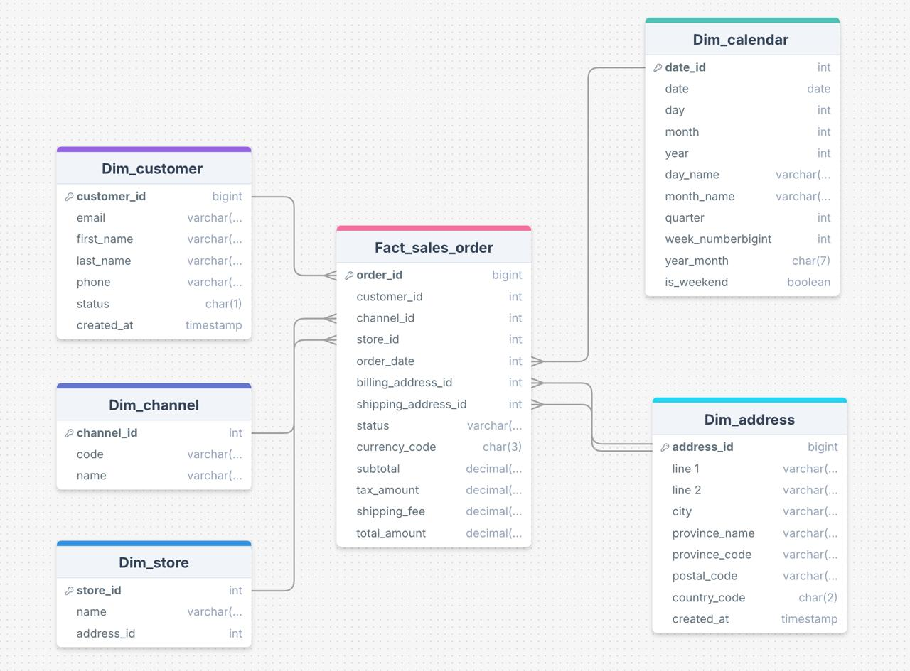
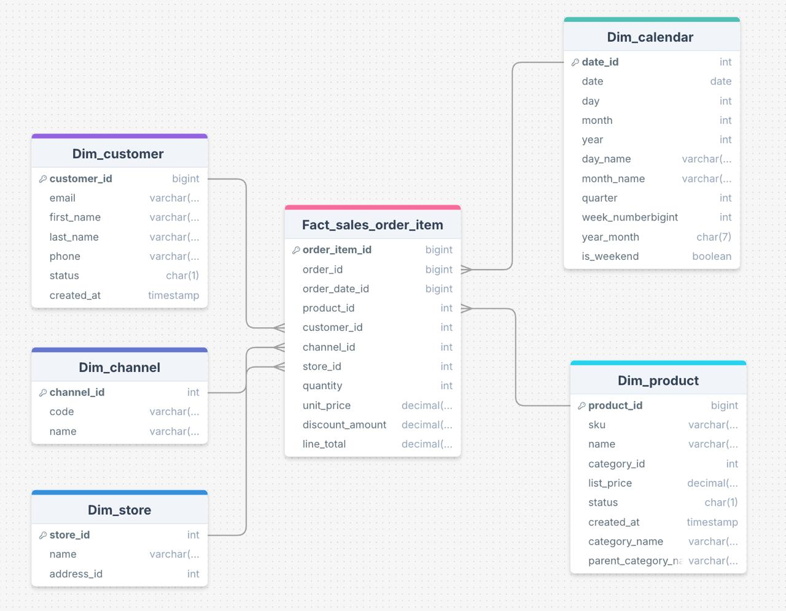
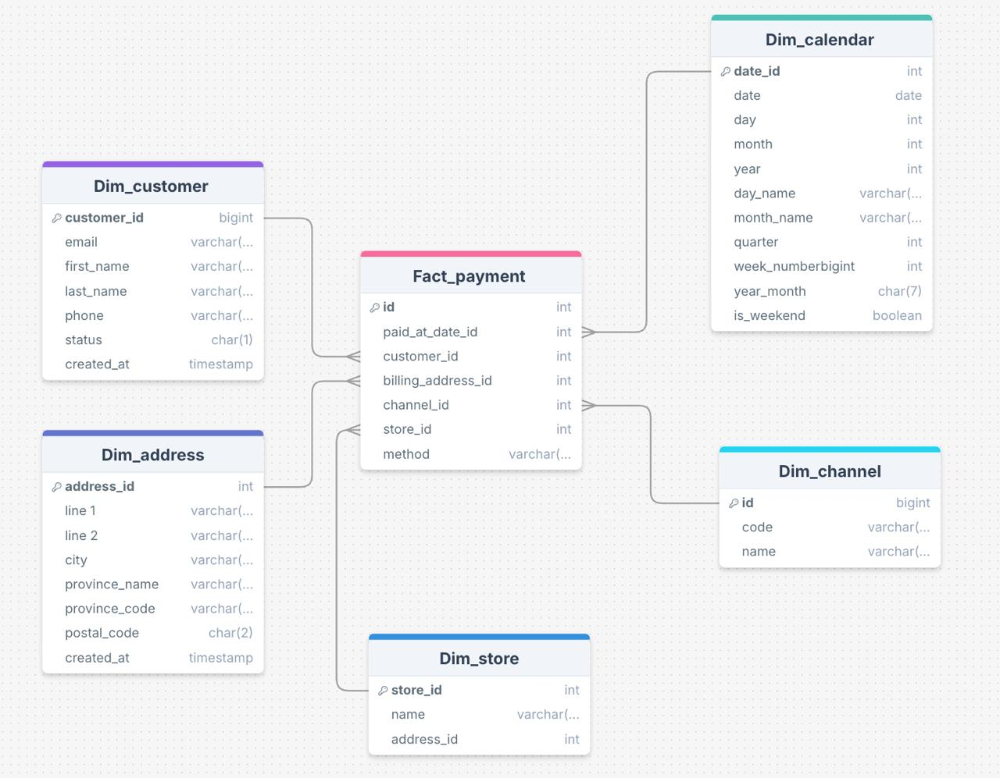
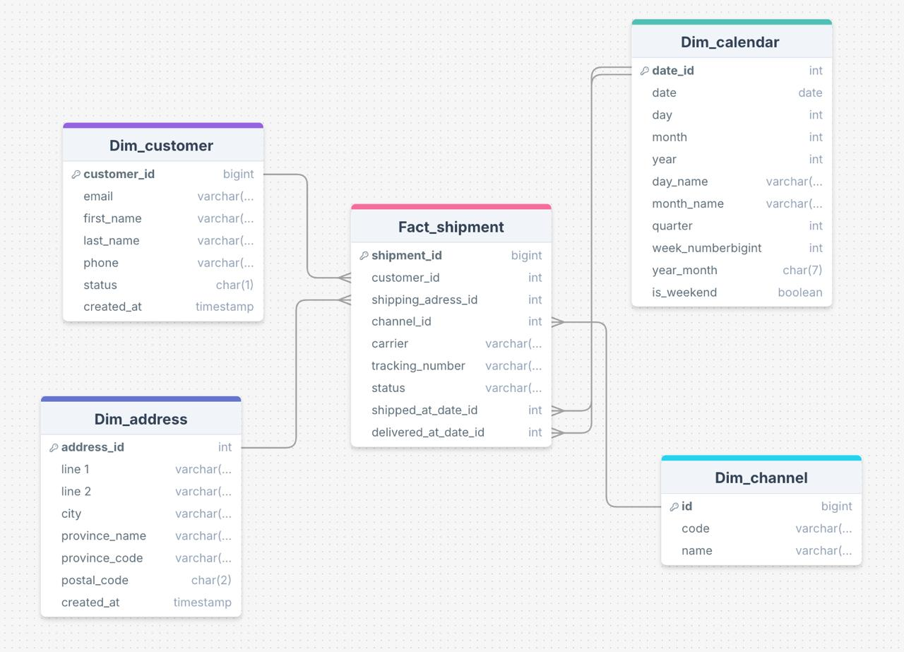
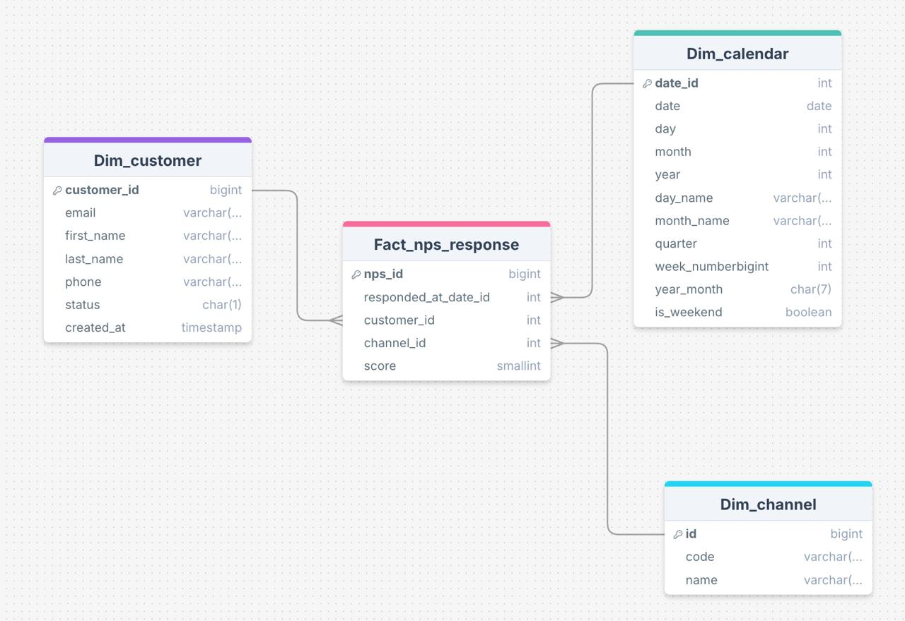
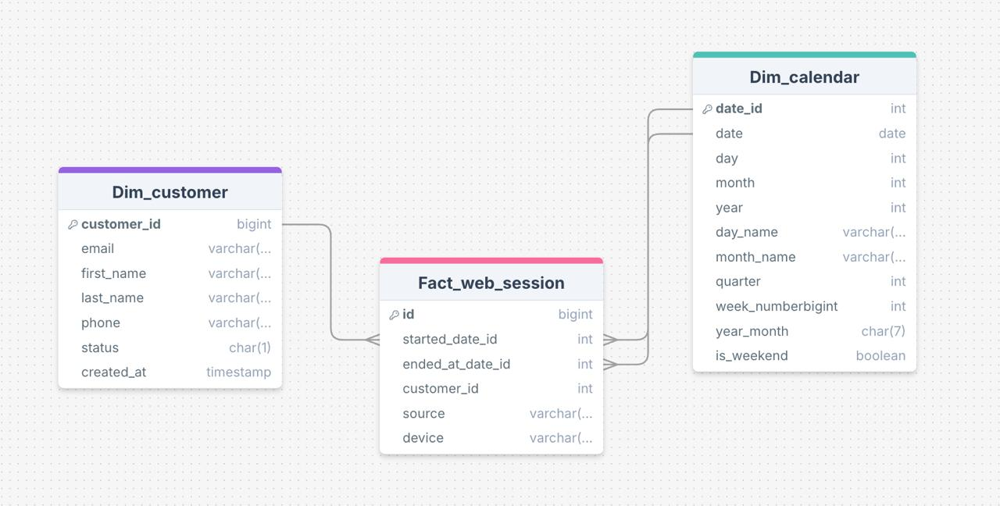

# Trabajo Práctico Final — Introducción al Marketing Online y los Negocios Digitales

Repositorio del trabajo práctico final de la materia "Introducción al Marketing Online y los Negocios Digitales".

## 📋 Descripción del proyecto
El presente trabajo práctico tiene como objetivo aplicar los conocimientos adquiridos sobre **procesos ETL (Extract, Transform, Load)**, **modelado de datos** y **visualización de información**, desarrollando un **Data Warehouse** y un **dashboard analítico** en Looker Studio.

A partir de un conjunto de datos transaccionales de una empresa de comercio electrónico, se buscó:

- Diseñar e implementar un **proceso ETL completo en Python**, capaz de extraer, transformar y cargar los datos desde distintas fuentes.
- Construir un **modelo dimensional (esquema en estrella)** que permita analizar métricas de negocio como ventas, clientes, productos, pagos y envíos.
- Generar **tablas desnormalizadas** dentro de la carpeta `DW/` para su consumo directo desde herramientas de BI.
- Diseñar un **dashboard interactivo** en Looker Studio que muestre los principales indicadores de gestión y rendimiento.

El proyecto fue desarrollado siguiendo buenas prácticas de ingeniería de datos: modularización del código, control de versiones con Git, entorno virtual gestionado con `venv` y documentación completa mediante este archivo `README.md`.

## 🗂️ Estructura del Repositorio

```bash
├── raw/                 # Datos originales (.csv) provistos por la empresa
├── DW/                  # Tablas finales del Data Warehouse (desnormalizadas)
├── ETL/                 # Proceso ETL (Extract, Transform, Load)
│   ├── extract/         # Extracción de datos desde raw/
│   ├── transform/       # Limpieza, modelado y creación de dimensiones / hechos
│   ├── load/            # Carga de datos transformados al DW
│   └── pipeline.py      # Orquestador principal del proceso ETL
│
├── assets/              # Diagramas, capturas o imágenes del proyecto
│
├── main.py              # Script principal para ejecutar el ETL
├── LICENSE              # Licencia del proyecto
├── .gitignore           # Archivos y carpetas ignorados por Git
└── README.md            # Documentación del proyecto
```

---

## 🧩 Herramientas y Requisitos

Para ejecutar correctamente el proyecto, es necesario contar con las siguientes herramientas y librerías instaladas en el entorno local:

- **Python 3.11 o superior** → lenguaje principal del proceso ETL.  
- **Visual Studio Code** → entorno de desarrollo recomendado.  
- **Git** → control de versiones y gestión del repositorio.  
- **Looker Studio** → herramienta de visualización para crear el dashboard final.  
- **Pandas** → manipulación y limpieza de datos.  
- **Pathlib** → manejo de rutas de archivos.  
- **venv** → creación de entornos virtuales. 

---

## 🚀 Instrucciones de Ejecución

A continuación se detallan los pasos necesarios para ejecutar el proceso ETL completo del proyecto.

---

### 1️⃣ Clonar el repositorio

```bash
git clone https://github.com/Execortesi/mkt_tp_final.git
cd mkt_tp_final
```

---

### 2️⃣ Crear y activar un entorno virtual

```bash
# Crear entorno virtual
python3 -m venv venv

# Activar entorno virtual
# En macOS / Linux:
source venv/bin/activate

# En Windows (PowerShell):
venv\Scripts\activate
```

---

### 3️⃣ Instalar dependencias 

```bash
pip install -r requirements.txt
```

---

### 4️⃣ Ejecutar el proceso ETL

```bash
# Ejecutar todas las etapas (dimensiones y hechos)
python main.py --step=all
```

---

## 🧾 Diccionario de Datos

A continuación se detalla el diccionario de datos correspondiente al Data Warehouse del proyecto,Incluye las tablas de **dimensiones** y **hechos**, junto con sus claves, dominios y descripciones.

---

### 🧱 Tablas de Dimensión

#### dim_channel
| Campo         | Tipo     | Clave | Descripción                                  |
|----------------|----------|--------|----------------------------------------------|
| channel_sk     | INT      | PK     | Identificador interno de la dimensión canal. |
| channel_bk     | STRING   | BK     | Clave de negocio (código único del canal).   |
| code           | STRING   |        | Código del canal (ONLINE / OFFLINE).         |
| name           | STRING   |        | Nombre descriptivo del canal.                |

---

#### dim_product
| Campo              | Tipo     | Clave | Descripción                                      |
|--------------------|----------|--------|--------------------------------------------------|
| product_sk         | INT      | PK     | Identificador interno del producto.              |
| product_bk         | STRING   | BK     | Clave de negocio del producto (SKU).             |
| sku                | STRING   |        | Código único del producto.                       |
| name               | STRING   |        | Nombre del producto.                             |
| category_bk        | STRING   | FK     | Clave de la categoría a la que pertenece.        |
| category_name      | STRING   |        | Nombre de la categoría.                          |
| list_price         | FLOAT    |        | Precio de lista.                                 |
| status             | STRING   |        | Estado del producto (A = activo, I = inactivo).  |
| created_at         | DATE     |        | Fecha de creación del registro.                  |

---

#### dim_customer
| Campo          | Tipo     | Clave | Descripción                                    |
|----------------|----------|--------|------------------------------------------------|
| customer_sk    | INT      | PK     | Identificador interno del cliente.             |
| customer_bk    | STRING   | BK     | Clave de negocio del cliente.                  |
| first_name     | STRING   |        | Nombre del cliente.                            |
| last_name      | STRING   |        | Apellido del cliente.                          |
| email          | STRING   |        | Correo electrónico.                            |
| phone          | STRING   |        | Número de teléfono.                            |
| address_bk     | STRING   | FK     | Clave foránea hacia la dirección.              |

---

#### dim_address
| Campo          | Tipo     | Clave | Descripción                                    |
|----------------|----------|--------|------------------------------------------------|
| address_sk     | INT      | PK     | Identificador interno de la dirección.         |
| address_bk     | STRING   | BK     | Clave de negocio de la dirección.              |
| street         | STRING   |        | Calle y número.                                |
| postal_code    | STRING   |        | Código postal.                                 |
| province_bk    | STRING   | FK     | Clave foránea hacia la provincia.              |

---

#### dim_province
| Campo         | Tipo     | Clave | Descripción                                  |
|---------------|----------|--------|----------------------------------------------|
| province_sk   | INT      | PK     | Identificador interno de la provincia.       |
| province_bk   | STRING   | BK     | Clave de negocio de la provincia.            |
| name          | STRING   |        | Nombre de la provincia.                      |

---

#### dim_store
| Campo         | Tipo     | Clave | Descripción                                  |
|---------------|----------|--------|----------------------------------------------|
| store_sk      | INT      | PK     | Identificador interno del local o tienda.    |
| store_bk      | STRING   | BK     | Clave de negocio del local.                  |
| name          | STRING   |        | Nombre comercial del local.                  |
| address_bk    | STRING   | FK     | Relación con la dirección de la tienda.      |

---

#### dim_calendar 
| Campo         | Tipo     | Clave | Descripción                                  |
|---------------|----------|--------|----------------------------------------------|
| date_sk       | INT      | PK     | Identificador único de la fecha (AAAAMMDD).  |
| date          | DATE     |        | Fecha completa.                              |
| year          | INT      |        | Año calendario.                              |
| quarter       | INT      |        | Trimestre (1–4).                             |
| month         | INT      |        | Mes (1–12).                                  |
| month_name    | STRING   |        | Nombre del mes.                              |
| day           | INT      |        | Día del mes.                                 |
| dow           | INT      |        | Día de la semana (1–7).                      |
| is_weekend    | BOOLEAN  |        | Indica si es fin de semana.                  |

---

### 📊 Tablas de Hechos

#### fact_sales_order
| Campo             | Tipo     | Clave | Descripción                                      |
|-------------------|----------|--------|--------------------------------------------------|
| order_bk          | STRING   | BK     | Clave de negocio de la orden.                    |
| customer_sk       | INT      | FK     | Cliente asociado a la orden.                     |
| channel_sk        | INT      | FK     | Canal de venta utilizado.                        |
| store_sk          | INT      | FK     | Tienda asociada (si aplica).                     |
| order_date_sk     | INT      | FK     | Fecha en que se realizó la orden.                |
| subtotal_amount   | FLOAT    |        | Subtotal de la orden.                            |
| shipping_fee      | FLOAT    |        | Costo de envío.                                  |
| discount_amount   | FLOAT    |        | Descuento aplicado.                              |
| total_amount      | FLOAT    |        | Total final pagado.                              |
| currency_code     | STRING   |        | Moneda de la transacción.                        |
| status            | STRING   |        | Estado del pedido (PAID, FULFILLED, CANCELLED).  |

---

#### fact_order_item
| Campo             | Tipo     | Clave | Descripción                                      |
|-------------------|----------|--------|--------------------------------------------------|
| order_item_sk     | INT      | PK     | Identificador interno del ítem.                  |
| order_item_bk     | STRING   | BK     | Clave de negocio del ítem.                       |
| sales_order_bk    | STRING   | FK     | Referencia al pedido principal.                  |
| product_bk        | STRING   | FK     | Producto vendido.                                |
| quantity          | INT      |        | Cantidad vendida.                                |
| list_price        | FLOAT    |        | Precio unitario.                                 |
| total_amount      | FLOAT    |        | Total del ítem (cantidad × precio).              |

---

#### fact_payment
| Campo             | Tipo     | Clave | Descripción                                      |
|-------------------|----------|--------|--------------------------------------------------|
| order_bk          | STRING   | FK     | Pedido asociado al pago.                         |
| paid_date_sk      | INT      | FK     | Fecha del pago.                                  |
| status            | STRING   |        | Estado del pago (PAID / REFUNDED).               |
| payment_method     | STRING   |        | Método de pago (tarjeta, efectivo, etc.).        |
| amount            | FLOAT    |        | Monto pagado.                                    |
| transaction_ref   | STRING   |        | Código de referencia del pago.                   |

---

#### fact_shipment
| Campo               | Tipo     | Clave | Descripción                                      |
|---------------------|----------|--------|--------------------------------------------------|
| order_bk            | STRING   | FK     | Pedido asociado al envío.                        |
| carrier             | STRING   |        | Empresa transportista.                           |
| tracking_number     | STRING   |        | Número de seguimiento del envío.                 |
| shipped_date_sk     | INT      | FK     | Fecha de despacho.                               |
| delivered_date_sk   | INT      | FK     | Fecha de entrega.                                |
| is_delivered        | BOOLEAN  |        | Indica si el pedido fue entregado.               |

---

#### fact_web_session
| Campo               | Tipo     | Clave | Descripción                                      |
|---------------------|----------|--------|--------------------------------------------------|
| session_bk          | STRING   | BK     | Clave de negocio de la sesión web.               |
| customer_sk         | INT      | FK     | Cliente que inició la sesión.                    |
| channel_sk          | INT      | FK     | Canal de ingreso.                                |
| start_date_sk       | INT      | FK     | Fecha de inicio de la sesión.                    |
| end_date_sk         | INT      | FK     | Fecha de cierre de la sesión.                    |
| device              | STRING   |        | Tipo de dispositivo (desktop, mobile, tablet).   |
| is_ended            | BOOLEAN  |        | Indica si la sesión fue finalizada.              |

---

#### fact_nps_response
| Campo              | Tipo     | Clave | Descripción                                      |
|--------------------|----------|--------|--------------------------------------------------|
| nps_bk             | STRING   | BK     | Clave de negocio de la respuesta.                |
| customer_sk        | INT      | FK     | Cliente que respondió la encuesta.               |
| channel_sk         | INT      | FK     | Canal de contacto.                               |
| responded_date_sk  | INT      | FK     | Fecha de respuesta.                              |
| score              | INT      |        | Puntuación NPS (0 a 10).                         |
| comment            | STRING   |        | Comentario del cliente.                          |

---

## 🧮 Modelos de datos 

### Diagramas de Estrella 
Se presentan los diagramas de estrella para cada una de las tablas de hechos:

### Fact_sales_order 


### Fact_sales_order_item


### Fact_payment 


### Fact_shipment


### Fact_nps_response


### Fact_web_session:


---

## 🧩 Supuestos del Modelo de Datos

- El modelo se basa en un **esquema en estrella (Star Schema)**, donde las **tablas de hechos** registran los eventos del negocio y las **dimensiones** describen su contexto.  
- Se utilizan **claves sustitutas (`_sk`)** generadas de forma incremental y **claves de negocio (`_bk`)** como referencia original.  
- Todas las **fechas** están unificadas en la tabla `dim_date`, con formato `YYYY-MM-DD`.  
- Cada cliente, producto, tienda y provincia tiene un registro único en su dimensión correspondiente.  
- Los datos se consideran **limpios y consistentes**, sin valores nulos críticos ni duplicados.  
- Las **tablas de hechos** representan transacciones y eventos: pedidos, pagos, envíos, sesiones web y respuestas NPS.  
- El proceso ETL se ejecuta desde `main.py`, generando automáticamente los archivos `.csv` en la carpeta `DW/` listos para análisis en Looker Studio.

## 📊 Dashboard 
El análisis final del proyecto se realizó mediante un dashboard interactivo en Looker Studio, utilizando como fuente principal la tabla One Big Table (OBT) generada en el proceso ETL.

La OBT consolida la información proveniente de todas las tablas de dimensión y hechos, permitiendo una integración completa de datos para construir visualizaciones dinámicas y comparativas entre ventas, clientes, canales y satisfacción.

📎 Acceso al dashboard: 

## 👤 Autor

Exequiel Cortesi

💻 Estudiante de la Licenciatura en Ciencias de Datos 